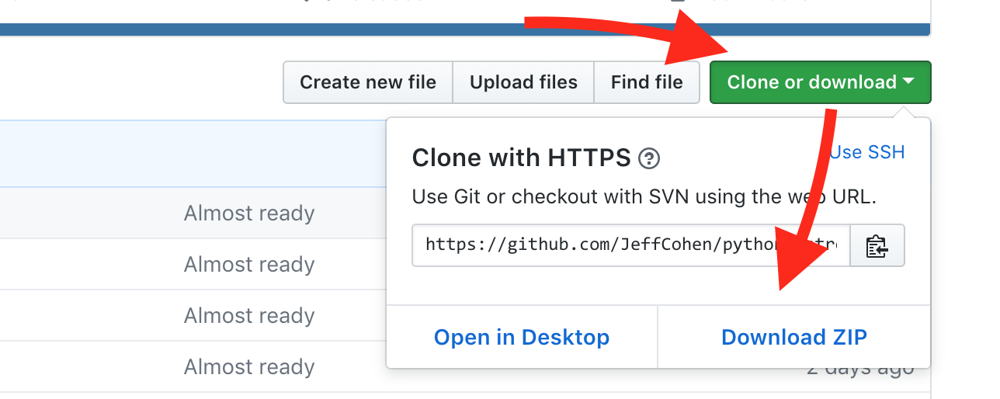

# Applied Python

### How To Get This Code

**If you are comfortable with git**, just clone this repo.

**Alternatively,** click the green "Clone or download" button and
select **Download ZIP**.  Unzip the file to a directory that
you can easily get to from your Terminal.

---

### Workshop Prerequisites

* Basic knowledge of Python basics
* A text editor
* A shell environment (Terminal, etc.)
* Python 3.x (3.6 or higher preferred)
* Optional: the "JSON Formatter" extension for Chrome

### Google-able Agenda

Google for these topics by prefixing them with "python",
i.e. "python constructors"

**1:30pm - 2:30pm**
* Object-Oriented Python
  * Classes
  * Data attributes and method attributes
  * Instance methods
  * Class methods
  * Constructors
  * Access control and private methods, `__slots__`
  * Properties
  * Named tuples
* Iteration
  * Function-oriented Python with `map` and `filter`
  * List comprehensions

**2:30pm - 3:30pm**
* Python Specialties
  * The special role of dictionaries
    * `object`.`__dict__`
    * `object`.`__class__`
    * `class`.`__bases__`
    * `class`.`__name__`
    * `class`.`__mro__`
  * Iterators: [The iteration protocol](iterators.md)
  * Lambdas
  * [Generators](generators.md)
  * Decorators
  * Closures

**3:30pm - 4:30pm**
  * Open Lab
